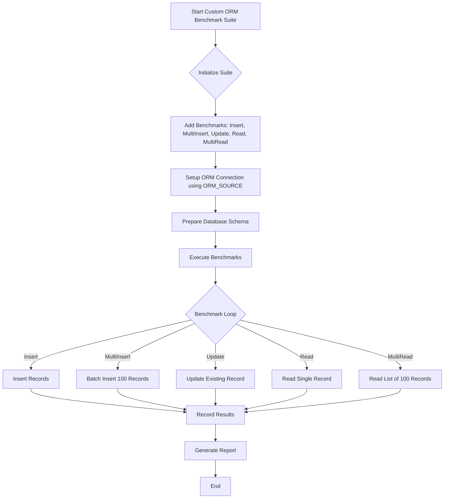

# Integrating Custom ORMs and Raw SQL

Extend the ORM Benchmark suite by adding your own ORM implementations or leveraging raw SQL workflows. This guide walks you through the process of creating a new benchmark suite, implementing key CRUD operations, and ensuring your new benchmarks remain consistent, fair, and comparable with existing ones.

---

## 1. Understanding the Benchmark Suite Structure

The ORM Benchmark organizes benchmarking scenarios as independent suites. Each suite corresponds to an ORM or raw SQL approach and contains multiple benchmarks for typical operations such as Insert, Multi-Insert, Update, Read, and Multi-Read.

Key Concepts:

- **Benchmark Suite**: A encapsulated set of related benchmarks for one ORM or method.
- **Benchmark Functions**: Functions implementing each individual test (e.g., insert, update).
- **Setup Functions**: Code initializing database connections, ORM sessions, and schema setup.
- **Model Struct**: A consistent entity definition used across benchmarks for comparability.

Your integration should fit cleanly within this structure.

<Info>
Consistent use of the `Model` struct or a close equivalent is critical to ensure your benchmarks are comparable with existing results.
</Info>

---

## 2. Setting Up Your Custom Benchmark Suite

### Step 1: Define Your Suite

Create a new Go source file in the `benchs` package, for example `benchs/customorm.go`. Start by defining a new suite and its initialization function.

```go
package benchs

import (
	"fmt"
	"context"
	"database/sql"
	// Import your ORM packages here
)

var customDB *YourORMType // replace with your ORM's DB/session type

func init() {
	st := NewSuite("customorm")
	st.InitF = func() {
		st.AddBenchmark("Insert", 200*ORM_MULTI, CustomInsert)
		st.AddBenchmark("MultiInsert 100 row", 200*ORM_MULTI, CustomInsertMulti)
		st.AddBenchmark("Update", 200*ORM_MULTI, CustomUpdate)
		st.AddBenchmark("Read", 200*ORM_MULTI, CustomRead)
		st.AddBenchmark("MultiRead limit 100", 200*ORM_MULTI, CustomReadSlice)

		// Initialize DB connection and ORM session
		// For example, connect to PostgreSQL using your ORM with ORM_SOURCE
		// customDB = yourORMConnectFunction(ORM_SOURCE)
	}
}
```

### Step 2: Implement Database Setup

Provide a schema setup function ensuring your database schema matches the benchmark model.

```go
func initCustomDB() {
	// Use a raw sql.DB connection or ORM migration tool to setup schema
	// Be sure the table and columns align with the existing Model struct
	// Example (using raw SQL):
	DB, err := sql.Open("postgres", ORM_SOURCE)
	checkErr(err)
	defer DB.Close()

	schemaSQL := []string{
		`DROP TABLE IF EXISTS custom_models;`,
		`CREATE TABLE custom_models (
			id SERIAL PRIMARY KEY,
			name TEXT NOT NULL,
			title TEXT NOT NULL,
			fax TEXT NOT NULL,
			web TEXT NOT NULL,
			age INTEGER NOT NULL,
			"right" BOOLEAN NOT NULL,
			counter BIGINT NOT NULL
		);`,
	}

	for _, q := range schemaSQL {
		_, err = DB.Exec(q)
		checkErr(err)
	}
}
```

### Step 3: Define Your Model

Use the existing `Model` struct from `benchs/utils.go` or create a structurally identical version adapted for your ORM.

```go
// If your ORM requires specific annotations, add them here,
// but maintain field names and types for comparability.

type CustomModel struct {
	Id      int
	Name    string
	Title   string
	Fax     string
	Web     string
	Age     int
	Right   bool
	Counter int64
}

func NewCustomModel() *CustomModel {
	return &CustomModel{
		Name: "Orm Benchmark",
		Title: "Just a Benchmark for fun",
		Fax: "99909990",
		Web: "http://blog.milkpod29.me",
		Age: 100,
		Right: true,
		Counter: 1000,
	}
}
```

---

## 3. Implementing Benchmark Functions

Implement five core benchmark functions following a consistent pattern:

- Use `wrapExecute` to pause and resume timer around setup operations.
- Initialize the model and database before running benchmarks.
- Run operations inside a loop `for i := 0; i < b.N; i++`.
- On error, output to console and call `b.FailNow()` to abort.

### Example: Insert

```go
func CustomInsert(b *B) {
	var m *CustomModel
	wrapExecute(b, func() {
		initCustomDB()
		m = NewCustomModel()
	})

	for i := 0; i < b.N; i++ {
		m.Id = 0 // reset PK
		// Perform insert using your ORM method
		if err := customDB.Insert(m); err != nil {
			fmt.Println(err)
			b.FailNow()
		}
	}
}
```

### Multi-Insert (100 rows)

Create 100 model instances, reset their Ids each iteration, then insert them in batch if possible.

```go
func CustomInsertMulti(b *B) {
	var ms []*CustomModel
	wrapExecute(b, func() {
		initCustomDB()
		ms = make([]*CustomModel, 0, 100)
		for i := 0; i < 100; i++ {
			ms = append(ms, NewCustomModel())
		}
	})

	for i := 0; i < b.N; i++ {
		for _, m := range ms {
			m.Id = 0
		}
		if err := customDB.InsertBatch(ms); err != nil {
			fmt.Println(err)
			b.FailNow()
		}
	}
}
```

### Update

Insert a record during setup, then update it repeatedly.

```go
func CustomUpdate(b *B) {
	var m *CustomModel
	wrapExecute(b, func() {
		initCustomDB()
		m = NewCustomModel()
		if err := customDB.Insert(m); err != nil {
			fmt.Println(err)
			b.FailNow()
		}
	})

	for i := 0; i < b.N; i++ {
		if err := customDB.Update(m); err != nil {
			fmt.Println(err)
			b.FailNow()
		}
	}
}
```

### Read (Single Record)

Insert a record once, then fetch it repeatedly in the benchmark.

```go
func CustomRead(b *B) {
	var m *CustomModel
	wrapExecute(b, func() {
		initCustomDB()
		m = NewCustomModel()
		if err := customDB.Insert(m); err != nil {
			fmt.Println(err)
			b.FailNow()
		}
	})

	for i := 0; i < b.N; i++ {
		var out CustomModel
		if err := customDB.Find(&out, m.Id); err != nil {
			fmt.Println(err)
			b.FailNow()
		}
	}
}
```

### Multi-Read (Limit 100)

Insert 100 records during setup, then benchmark fetching a list of records.

```go
func CustomReadSlice(b *B) {
	var m *CustomModel
	wrapExecute(b, func() {
		initCustomDB()
		m = NewCustomModel()
		for i := 0; i < 100; i++ {
			m.Id = 0
			if err := customDB.Insert(m); err != nil {
				fmt.Println(err)
				b.FailNow()
			}
		}
	})

	for i := 0; i < b.N; i++ {
		var models []CustomModel
		if err := customDB.FindLimit(&models, 100); err != nil {
			fmt.Println(err)
			b.FailNow()
		}
	}
}
```

---

## 4. Best Practices for Benchmark Integration

- **Maintain Consistency:** Use the same model structure and table schema as other benchmarks.
- **Leverage Existing Helpers:** Use the `wrapExecute` method to avoid skewing benchmarks with setup time.
- **Avoid Caching Effects:** Ensure the DB queries run fresh each iteration for fair timing.
- **Error Handling:** Log errors and abort benchmarks immediately on failures to maintain integrity.
- **Keep Batch Size Consistent:** Use 100 rows for multi-inserts and multi-reads to align with existing benchmarks.

---

## 5. Common Pitfalls and How to Avoid Them

<AccordionGroup title="Troubleshooting Common Integration Issues">
<Accordion title="Schema Mismatch">
Ensure your table columns exactly match the benchmark's expected fields. Misalignments can cause runtime errors or invalid benchmarks.
</Accordion>
<Accordion title="Incorrect Multi-Insert Implementation">
Implement multi-insert using a single query or batch operation as supported by your ORM. Inserting rows one by one unbatched introduces unfair timing inflation.
</Accordion>
<Accordion title="Failing to Reset IDs">
Always reset primary key IDs (`Id = 0`) before inserts to avoid conflicts and correctly simulate new inserts.
</Accordion>
<Accordion title="Ignoring Error Checks">
Handle errors consistently by printing errors and calling `b.FailNow()`. Ignoring errors can produce misleading benchmark results.
</Accordion>
</AccordionGroup>

---

## 6. Example: Reference Implementation for Bun ORM

The `benchs/bun.go` file provides a concrete integration example with Bun ORM:

- Initialization opens a PostgreSQL driver connection.
- Benchmarks cover Insert, MultiInsert, Update, Read, MultiRead.
- Uses context for queries and batch operations for multi-insert.

Refer to this for idiomatic, tested patterns.

---

## 7. Integration Workflow Diagram



---

## 8. Next Steps

- **Run Your Benchmarks:** Use `go run main.go -orm=customorm` to include your new suite.
- **Interpret Results:** Compare with existing ORM benchmarks to validate.
- **Share and Contribute:** Submit pull requests to contribute your ORM benchmarking code.
- **Explore Advanced Topics:** Check profiling guides and troubleshooting documentation.

---

## References

- [Supported ORMs & Technologies](/overview/architecture-and-core-concepts/supported-orms)
- [Integration & Setup Overview](/overview/architecture-and-core-concepts/integration-and-setup)
- Examples: `benchs/bun.go`, `benchs/gorm.go`, `benchs/raw.go`
- Utils and helpers in `benchs/utils.go`

---

<Tip>
Integrating a benchmark requires both technical correctness and consistency to preserve the validity of comparative results.
Maintain alignment with existing patterns to achieve trustworthy and insightful performance data.
</Tip>

---

End of Guide
