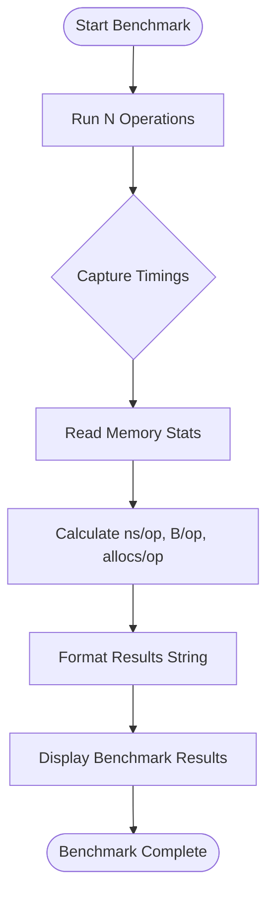

# Interpreting and Comparing Benchmark Results

## 1. Understanding Benchmark Output

When you run ORM Benchmark, the output provides detailed measurements to help you assess the performance of various ORMs across a set of database operations. This guide will help you interpret these results accurately and effectively.

### Key Metrics Explained

- **Time (Total Duration)**: The total time taken to complete all operations in a benchmark, shown in seconds (s).
- **ns/op (Nanoseconds per Operation)**: Average time spent per single operation, expressed in nanoseconds. Lower values indicate faster performance.
- **B/op (Bytes per Operation)**: The average number of bytes allocated in memory per operation. Lower memory allocations often mean better efficiency.
- **allocs/op (Allocations per Operation)**: Counts how many distinct memory allocations occur per operation. Fewer allocations can improve performance by reducing garbage collection overhead.

### Example Output Snippet

```text
               Insert:   10.00s  1500.0 ns/op    160 B/op   10 allocs/op
```

This indicates that the Insert benchmark:

- Ran for 10 seconds total.
- Each insert operation took 1500 nanoseconds on average.
- Each operation allocated 160 bytes.
- Each operation caused 10 memory allocations.

### Interpreting Failures

If a benchmark cannot complete due to an error, you will see an explicit failure message in the output. This helps identify unsupported operations or configuration issues.

## 2. How Benchmarks Are Structured

The ORM Benchmark divides performance tests into common operations:

- **Insert**: Single record insertion.
- **MultiInsert 100 row**: Batch insertion of 100 records.
- **Update**: Updating an existing record.
- **Read**: Reading a single record.
- **MultiRead limit 100**: Reading multiple records (100 rows) at once.

Each ORM suite runs these benchmarks independently, ensuring isolated and repeatable results.

## 3. Step-by-Step Guide to Comparing Results

### Step 1: Run Your Benchmarks

Use the standard CLI options to run benchmarks against selected ORMs. For example:

```shell
# Run all ORMs concurrently with a multiplier of 20
go run main.go -multi=20 -orm=all
```

### Step 2: Review Results for Each Operation

Look at the output for each operation grouped by ORM brand. The results are sorted by operation duration, letting you see which ORM is fastest per category.

### Step 3: Compare ns/op Values

Focus on **ns/op** to understand speed differences. An ORM with consistently lower ns/op values is faster at that particular operation.

### Step 4: Analyze Memory Use

Compare **B/op** and **allocs/op** to judge memory efficiency. Lower allocations reduce pressure on Go's garbage collector and improve scalability.

### Step 5: Identify Outliers and Failures

Watch out for benchmarks marked with failure messages. These typically highlight operational incompatibilities or bugs.

<Tip>
Lower ns/op, B/op, and allocs/op values consistently across all operations signify a more performant ORM in your test scenario.
</Tip>

## 4. Best Practices for Meaningful Comparisons

- **Use consistent benchmark parameters** such as the concurrency multiplier (`-multi`) and connection settings (`-max_idle`, `-max_conn`).
- **Run benchmarks multiple times** to smooth out transient effects.
- **Consider workload relevance**: Batch inserts may matter more in bulk processing applications, whereas read performance might be key in read-heavy workloads.
- **Account for failed benchmarks**: Some operations (like multi-insert in GORM v1 or XORM) may fail and should be interpreted as limitations.

## 5. Visualizing and Reporting Results

After running benchmarks, outputs look like the following example:

```text
  200 times - Insert
       gorm:    4.30s  21500 ns/op   120 B/op   8 allocs/op
       bun:     3.80s  19000 ns/op    90 B/op   5 allocs/op
       xorm:    6.50s  32500 ns/op   150 B/op  12 allocs/op

  200 times - MultiInsert 100 row
       gorm:      failed
       bun:     7.80s  39000 ns/op   200 B/op  20 allocs/op

```

Such summaries enable side-by-side assessment of ORM capabilities for each key operation.

## 6. Common Pitfalls When Interpreting Results

- **Ignoring context**: Remember that benchmark conditions like hardware, database setup, and network latency affect results.
- **Overlooking memory metrics**: Speed is important, but excessive memory use can degrade real-world performance.
- **Assuming failure means poor ORM**: Failures might reflect unsupported features or unimplemented test cases.

## 7. Troubleshooting Unexpected Results

<AccordionGroup title="Troubleshooting Benchmark Results">
<Accordion title="Benchmark Output is Incomplete or Missing">
Ensure your database connection string is correct and PostgreSQL is running. Review Setup guides for environment validation.
</Accordion>
<Accordion title="Benchmarks Show Unexpected Failures">
Check ORM-specific limitations like unsupported multi-insert in GORM v1 or XORM. Consult Troubleshooting Common Issues documentation.
</Accordion>
<Accordion title="Inconsistent Timing Across Runs">
Verify that no other heavy workloads interfere during benchmarking. Use consistent concurrency settings and rerun tests.
</Accordion>
</AccordionGroup>

## 8. Next Steps

- Explore the [Configuring Benchmarks for Different ORMs](../benchmark-workflows/configuring-benchmarks) guide to customize your benchmarking runs.
- Dive into [Profiling and Performance Optimization Tips](../benchmark-workflows/profiling-optimization) for deeper insights.
- Validate your environment using the [Quick Validation Checklist](../../getting-started/validation-and-troubleshooting/quick-validation).

---

## Appendix: How ORM Benchmark Produces These Results

Under the hood, each ORM benchmark runs a set number of operations (`N`), measuring:

- **Elapsed Time:** Captured from the timer start and stop.
- **Memory allocations:** Using Go runtime's `MemStats` for mallocs and bytes allocated.

The formula to calculate average time per operation is:

```
ns/op = Total elapsed time in nanoseconds / Number of operations
```

Similarly, memory usage is averaged per operation to provide `B/op` and `allocs/op`.

This data is then formatted into the output string you see under each benchmark.

## Visual Workflow of Benchmark Output Processing



This straightforward process ensures measurements are consistent, reliable, and user-readable.

---

## References

- [Running Your First Benchmark](../../getting-started/installation-and-first-run/running-your-first-benchmark) for executing and observing benchmarks.
- [Configuration & Customization Options](../../getting-started/installation-and-first-run/configuration-options) for tuning flags that influence results.
- [Troubleshooting Common Issues](../../getting-started/validation-and-troubleshooting/troubleshooting-common-issues) for resolving errors impacting benchmarks.
- [Supported ORMs & Technologies](../../overview/architecture-and-core-concepts/supported-orms) for understanding ORM-specific characteristics.

---