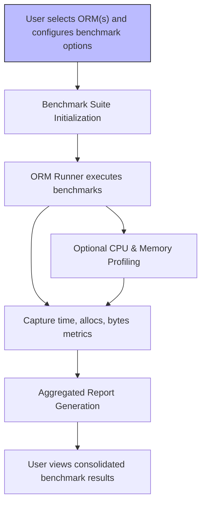

# Core Concepts & Terminology

## Introduction

Before you dive into the specifics of ORM Benchmark, it's essential to understand the foundational concepts and terminology that govern its operation. This section clarifies the key terms such as **benchmark suite**, **ORM runner**, **profiling**, and **report aggregation**. Understanding these terms will help you follow the user workflows, interpret results correctly, and customize benchmarks effectively.

---

## Benchmark Suite

A *benchmark suite* represents a collection of related benchmark tests grouped under a common name — typically an ORM or a database access method under test. Each suite encapsulates multiple benchmark scenarios to measure various database operations (such as insert, update, read) under controlled conditions.

### What it Means for Users
- You select an ORM benchmark suite to execute a predefined set of tests.
- Each suite initializes its environment, database schema, and test models before running.
- Suites offer reproducible and isolated performance tests for fair comparison.

### Example
In the code, you might see something like this:

```go
st := NewSuite("gorm")
st.InitF = func() {
    st.AddBenchmark("Insert", 200*ORM_MULTI, GormInsert)
    st.AddBenchmark("Read", 200*ORM_MULTI, GormRead)
    // Additional benchmarks
}
```
Here, "gorm" is a benchmark suite containing insert and read benchmarks for the Gorm ORM library.

---

## ORM Runner

The *ORM runner* is the component responsible for executing the individual benchmark functions for the ORM being tested. It controls the lifecycle of each benchmark — preparing data, measuring execution time, memory allocation, and handling errors.

### User Perspective
- The runner executes benchmarks multiple times using a parameter `N` to get stable performance data.
- It manages timing and resource measurement transparently, so you get accurate ns/op, memory usage, and allocations.
- If a benchmark fails due to errors such as SQL issues, it halts and reports failure clearly.

### Key Workflow
1. Setup database and schema
2. Create test entities with default data
3. Run test operations in loops to measure performance
4. Collect metrics and pass results for reporting

This workflow ensures consistency and accurate capture of ORM behaviors under load.

---

## Profiling

Profiling refers to the detailed measurement of CPU and memory usage during benchmark execution. ORM Benchmark supports profiling modes that give insights beyond raw timings — allowing you to optimize ORM usage effectively.

### What Users Can Do
- Enable CPU profiling to record CPU usage patterns and hotspots.
- Enable memory profiling to inspect allocations and garbage collection behavior.
- Analyze `.pprof` output files using Go tooling to drill down into performance bottlenecks.

### How to Use It
Include command-line flags such as `-cpu` or `-mem` during benchmark runs:

```bash
go run main.go -cpu=true -mem=true -orm=gorm
```
This generates profiles saved as `cpu.pprof` and `mem.pprof` in your working directory.

---

## Report Aggregation

After benchmarks run, the ORM Benchmark tool aggregates results from all executed suites and tests into a comprehensive report summarizing comparative performance.

### User Benefits
- View normalized metrics like time per operation (ns/op), bytes allocated, and memory allocations.
- Quickly scan to identify which ORM delivers the best throughput or least resource consumption.
- Use comparative tables to identify performance trade-offs between ORMs or SQL approaches.

### Example Report Snippet
```
              Insert: 1200 times
       gorm:    12.34 ms/op   450 B/op   15 allocs/op
       bun:     10.01 ms/op   300 B/op   12 allocs/op
```
This helps you prioritize which ORM suits your performance needs.

---

## How These Concepts Interact In Your Workflow



This diagram illustrates the end-to-end flow from user inputs to final report generation, showing how core concepts connect in the benchmarking lifecycle.

---

## Practical Tips & Best Practices

- **Start simple:** Run a single ORM suite on a small scale to validate setup before scaling with `-multi` or multiple ORMs.
- **Enable profiling for optimizations:** When results surprise you, CPU and memory profiling will uncover hidden inefficiencies.
- **Review failure messages carefully:** Benchmarks will stop on database errors or setup issues; check logs to quickly diagnose and fix.
- **Reset between benchmarks:** The tool restarts state and schema for each suite, ensuring no data leakage affects results.
- **Use consistent environments:** Network, PostgreSQL configuration, and hardware affect results — keep them stable for comparability.

---

## Summary

This page equips you with the fundamental concepts to confidently navigate ORM Benchmark:

- Understand what a **benchmark suite** is and why it organizes individual tests.
- Know the role of the **ORM runner** in executing and measuring benchmarks reliably.
- Learn how **profiling** enhances insights beyond simple time measurements.
- See how **report aggregation** synthesizes detailed metrics into user-friendly summaries.

With this conceptual clarity, you’re ready to explore ORM-specific benchmarks, system architecture, or dive into setup and usage guides.

---

## Related Documentation & Next Steps

- [System Architecture](/overview/architecture-and-core-concepts/system-architecture): Visualize how these concepts integrate system-wide.
- [Supported ORMs & Technologies](/overview/architecture-and-core-concepts/supported-orms): Examine specific ORM suites covered.
- [Running Your First Benchmark](/getting-started/installation-and-first-run/running-your-first-benchmark): Put these concepts into practice with your first run.
- [Profiling and Performance Optimization](/guides/benchmark-workflows/profiling-optimization): Deep dive into using profiles effectively.

---

If you encounter any uncertainties or errors during benchmarking, remember that the defined terms here underpin troubleshooting and customization throughout the documentation.