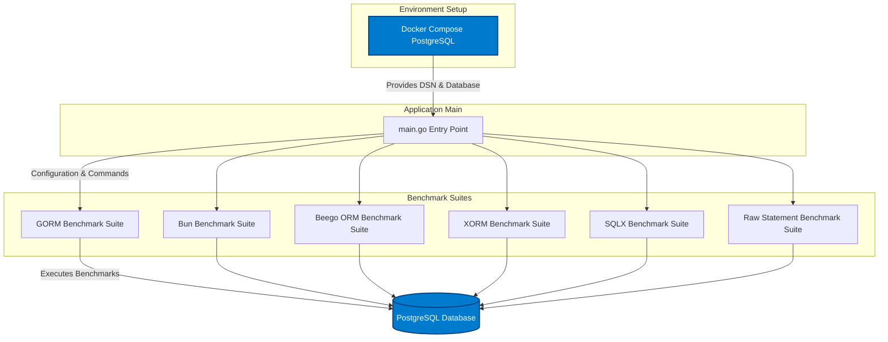

# Integration & Setup Overview

Welcome to the Integration & Setup Overview of ORM Benchmark. This page guides you through the essential steps for preparing your benchmarking environment using Docker Compose and explains how the main application orchestrates benchmark execution via configuration and entry points. Whether you're performing your initial setup or integrating benchmarking into your workflow, this overview clarifies the interaction between environment setup and benchmark orchestration.

---

## Why This Matters: Seamless Setup for Reliable Benchmarking

Effective benchmarking demands a stable, consistent environment and a clear, reproducible integration pattern. ORM Benchmark uses Docker Compose to provision and run a PostgreSQL database effortlessly, removing the complexities of manual dependency management. The main application entry point (`main.go`) then consumes this environment configuration to execute benchmarks smoothly across multiple ORM libraries.

By mastering this setup, you ensure your benchmark runs are both reliable and consistent, empowering you to effectively compare ORM performance without environment-related variance.

---

## Environment Setup with Docker Compose

The starting point for any benchmarking is a reliable data store. ORM Benchmark recommends using Docker Compose to launch a ready-to-use PostgreSQL instance.

### What Docker Compose Provides
- **Easy startup**: One command to spin up the PostgreSQL database container with predefined configurations.
- **Isolation**: Keeps the database environment consistent, isolated, and disposable.
- **Repeatability**: Ensures each benchmark run begins with a clean slate.

### Getting Started with Docker Compose
From the root of the ORM Benchmark repository, execute:

```bash
docker-compose up
```

This command initiates the PostgreSQL container, setting up the network and database necessary for the benchmarks. It ensures that `main.go` can connect to the default data source without extra manual database provisioning.

<Tip>
Ensure Docker and Docker Compose are installed and running correctly on your machine before executing this step. Refer to the [System Requirements](https://your-docs-domain/getting-started/setup-prerequisites/system-requirements) for details.
</Tip>

---

## Main Entry Point: Orchestrating Benchmark Execution

The core orchestration is handled by the `main.go` file, which is the application’s primary entry point. It manages configuration intake, environment preparation, and benchmark execution across the supported ORMs.

### How `main.go` Works
- **Configuration intake:** Reads command-line flags such as:
  - `-multi` to multiply query counts
  - `-orm` to select which ORMs to benchmark
  - `-source` PostgreSQL Data Source Name (DSN)
  - Connection pool limits (`-max_idle`, `-max_conn`)
  - Profiling options for CPU and memory
- **Environment setup:** Sets Go runtime CPU usage, disables SSL requirements for PostgreSQL, and ensures proper profiles are recorded if enabled.
- **Benchmark execution:** Based on selected ORMs, it shuffles the order for unbiased testing and invokes the respective benchmarking suite.
- **Reporting:** After benchmarks complete, it aggregates results and prints a summary report to the console.

#### Sample execution command:

```bash
go run main.go -multi=20 -orm=all
```

This command runs all included benchmarks with 20x workload scaling.

### Configuration Variables in Use
The core benchmarks and environment use variables set by `main.go`:

| Variable      | Description                          |
|---------------|------------------------------------|
| `ORM_MULTI`   | Multiplication factor for workloads|
| `ORM_MAX_IDLE`| Maximum idle DB connections        |
| `ORM_MAX_CONN`| Maximum open DB connections        |
| `ORM_SOURCE`  | PostgreSQL DSN connection string   |

These are leveraged across benchmarks to tune workload intensity and database connection management dynamically.

---

## Integration Points: Benchmark Suites and Database Initialization

The benchmark suites for each ORM initialize their environments before running tests. This includes:

- Dropping existing test tables
- Creating schema tables specific to each ORM
- Populating initial test data

These initialization steps ensure clean-state benchmarking and accurate performance metrics.

For example, the `gorm` benchmark suite (`benchs/gorm.go`) opens a connection using the DSN passed via `ORM_SOURCE`, sets up transaction skipping and prepared statements mode for performance, and defines multiple benchmarks:

- Insert single rows
- Multi-insert of 100 rows
- Update a record
- Read single record
- Read multiple records with limits

All benchmarks wrap database setup calls (`initDB()`) to ensure the database is reset before tests run, guaranteeing consistent results.

---

## How It All Fits Together



This flowchart highlights the core integration:
- Docker Compose sets up the PostgreSQL environment.
- `main.go` connects and manages configurations.
- Each benchmark suite initializes and runs its tests against the common PostgreSQL database.

---

## Practical Tips & Best Practices

- **Consistent environment:** Always start with `docker-compose up` to ensure a fresh database state.
- **Use the provided DSN:** The default connection string targets the Dockerized PostgreSQL; modifying it requires matching database availability.
- **Manage concurrency:** Adjust `-max_idle` and `-max_conn` flags to accommodate your system and workload efficiently.
- **Enable profiling cautiously:** CPU and memory profiling can help diagnose bottlenecks but may add overhead.
- **Selective ORM runs:** Use the `-orm` flag to isolate benchmarking of specific ORM libraries, speeding your tests.

---

## Troubleshooting Setup Issues

<AccordionGroup title="Common Setup Issues & Solutions">
<Accordion title="Docker Compose Fails to Start PostgreSQL">
Check that Docker engine is running. Review Docker Compose logs for error details using:

```bash
docker-compose logs
```
Ensure no port conflicts on `5432`.
</Accordion>

<Accordion title="Connection Errors from `main.go`">
Verify the DSN passed to `-source` matches the running PostgreSQL instance.
Check that `PGSSLMODE` is set to `disable` to avoid SSL errors.
</Accordion>

<Accordion title="Benchmark Suite Failures during Initialization">
Confirm no leftover tables exist in the database that could block table creation.
Manually connect to PostgreSQL and drop any lingering tables if needed.
</Accordion>
</AccordionGroup>

---

## Next Steps

Once your environment is ready and integration is understood:

- Proceed to [System Architecture](https://your-docs-domain/overview/architecture-and-core-concepts/system-architecture) to visualize how all components align.
- Follow [Running Your First Benchmark](https://your-docs-domain/getting-started/installation-and-first-run/running-your-first-benchmark) for detailed guidance on executing tests.
- Explore [Configuring Benchmarks for Different ORMs](https://your-docs-domain/guides/benchmark-workflows/configuring-benchmarks) to customize your benchmarking scenarios.

---

With this foundation, you can harness ORM Benchmark’s power for clear, reliable ORM performance insights.


---

## References

- [Official ORM Benchmark GitHub Repository](https://github.com/go-gorm/orm-benchmark)
- [Docker Compose Setup](README.md section)
- [Supported ORMs & Technologies](https://your-docs-domain/overview/architecture-and-core-concepts/supported-orms)
- [System Architecture Overview](https://your-docs-domain/overview/architecture-and-core-concepts/system-architecture)

---