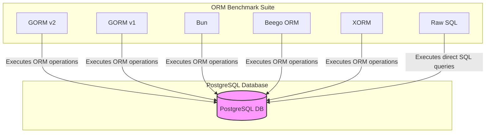

# Supported ORMs & Technologies

## Introduction

This documentation introduces the core Go ORM libraries and native SQL methods benchmarked by ORM Benchmark. Understanding these technologies and their role in the benchmarking suite will help you grasp why comparing them yields practical insights for developers aiming to choose the right ORM for their projects.

Whether you are evaluating mature ORM frameworks or lean raw SQL usage, this page provides essential context on each tested technology, highlighting their purpose, typical use cases, and why they deserve inclusion in a comprehensive benchmarking suite.

---

## What This Page Covers

- Overview of each supported ORM and raw SQL usage implemented in the benchmark
- Basic context about their design and functionality
- Why benchmarking them together matters

---

## Supported ORMs and Native SQL Methods

### 1. GORM v2 (gorm.go)

**Description:**  
GORM v2 is the latest major version of GORM, one of the most popular and feature-rich ORM libraries for Go. It provides robust abstractions for managing database operations with PostgreSQL and other supported dialects.

**Typical Use Cases:**  
Developers seeking a powerful ORM with support for hooks, callbacks, eager loading, transactions, and rich query construction often choose GORM.

**Benchmark Highlights:**  
- Tests include insert, batch insert (100 rows), update, single read, and batch read.
- Uses PostgreSQL driver directly with configuration optimized for benchmarking such as skipping transactions and using prepared statements.

---

### 2. GORM v1 (gorm_v1.go)

**Description:**  
This is the older, legacy version of GORM (v1) benchmarked for comparison against its modern successor GORM v2. It uses a different internal architecture and callback mechanisms.

**Typical Use Cases:**  
Maintaining legacy applications or evaluating improvements between generations.

**Benchmark Highlights:**  
- Includes the same core benchmark scenarios: insertion, multi-insert (though this multi-insert triggers a panic indicating lack of support), update, read, and multi-read.
- Explicitly disables transaction callbacks to streamline benchmark consistency.

---

### 3. Bun (bun.go)

**Description:**  
Bun is a high-performance, idiomatic Go ORM built on top of `pgdriver` and optimized for PostgreSQL. It supports rich query capabilities with explicit context passing.

**Typical Use Cases:**  
Developers emphasizing modern Go idioms, context-aware queries, and performance.

**Benchmark Highlights:**  
- Benchmarks cover the full cycle of insert, batch insert of 100 rows, update, read, and batch read.
- Implements context-aware operations ensuring concurrency-safe benchmarks.

---

### 4. Raw SQL with database/sql (raw.go + raw_stmt.go)

**Description:**  
Direct usage of Go's standard `database/sql` package with PostgreSQL driver without any ORM abstraction. Includes raw SQL strings for insert, update, select operations.

**Typical Use Cases:**  
When maximum control over SQL execution and minimal overhead are required.

**Benchmark Highlights:**  
- Includes prepared statement-based benchmarking (`raw_stmt.go`) for execution efficiency.
- Multi-insert constructed dynamically with positional parameters for batch efficiency.
- The absence of LastInsertId support on PostgreSQL is accounted for.

---

### 5. Beego ORM (beego_orm.go)

**Description:**  
Beego ORM is a part of the Beego framework, focusing on easy database interactions with support for multiple databases including PostgreSQL.

**Typical Use Cases:**  
Applications that already use the Beego ecosystem or value convention-based ORM.

**Benchmark Highlights:**  
- Extensive support for insert, multi-insert, update, read, and batch read.
- Uses Beego's `orm.Ormer` interface.

---

### 6. XORM (xorm.go)

**Description:**  
XORM provides a simple and expressive way to interact with databases in Go, with emphasis on being lightweight and easy to use.

**Typical Use Cases:**  
Developers looking for straightforward ORM support with intuitive APIs.

**Benchmark Highlights:**  
- Benchmarked for the same operations as other ORMs, albeit some batch read operations are indicated as unsupported and explicitly panic.
- Optimized for PostgreSQL in this harness.

---

## Why Benchmark These Technologies Together?

- **Comprehensive Comparison:** These ORMs and raw SQL approaches represent a broad spectrum from full-featured ORMs to direct SQL handling. Benchmarking them side-by-side helps identify real-world trade-offs.

- **Performance Insights:** Developers gain insights into the overhead introduced by abstractions versus raw SQL.

- **Feature vs. Speed Trade-Offs:** Some ORMs offer richer features but may be slower, while raw SQL requires more manual work but is faster.

- **Legacy vs Modern:** Comparing GORM v1 and v2 illustrates evolution in ORM design patterns within the Go ecosystem.

- **Ecosystem Coverage:** Including Beego ORM and XORM reflects benchmarking of popular, but less mainstream, libraries used in production.

---

## Typical User Workflow Involving These ORMs

1. **Setup:** Configure the benchmark environment with PostgreSQL running.
2. **Run:** Select specific ORMs or run all to execute the predefined benchmarks representing common database operations.
3. **Compare:** Review performance reports to understand latency, throughput, and resource usage profiles.
4. **Decide:** Use the data to inform technology choices for projects needing stable, performant data layers.

---

## Practical Tips

- Always initialize your database schema using the provided init functions (e.g., `initDB`, `initDB2`, `initDB3`) before benchmarking a specific ORM to ensure consistent baseline.

- For batch operations, be aware that some ORMs may not fully support multi-row inserts or may panic—this reflects their current limitations and impacts applicability.

- Use concurrency tuning parameters like `max_idle` and `max_conn` to simulate realistic application workloads.

- Consider profiling CPU and memory to understand resource consumption as part of full evaluation.

---

## Common Pitfalls

- **Unsupported Benchmarks:** Attempts to run multi-insert or multi-read may panic or fail on some ORMs (e.g., GORM v1 and XORM indicate lack of support for some batch operations).

- **Database Schema Mismatch:** Inconsistent or forgotten schema initialization causes failures or skewed results.

- **Ignoring Context:** Some ORMs, like Bun, require context passed explicitly which is critical in concurrent benchmarks.

- **Resource Exhaustion:** Overloading connection parameters beyond PostgreSQL capacity can lead to connection errors during tests.

---

## Next Steps

To fully utilize the benchmarks and technologies presented here, consider exploring these documentation pages:

- [System Architecture](/overview/architecture-and-core-concepts/system-architecture) for understanding orchestration and benchmark flow.
- [Getting Started](/getting-started/installation-and-first-run/cloning-and-setup) to set up your environment.
- Individual benchmark pages (`benchs/gorm.go`, `benchs/bun.go`, `benchs/raw.go`, etc.) for deep dives and modification.
- [Interpreting Results](/guides/benchmark-workflows/interpreting-results) to analyze benchmark outputs effectively.

---

This multi-ORM benchmarking suite empowers developers to make informed decisions by providing transparent, repeatable performance measurements across different Go ORM technologies.

---

## References

- [GORM Official Website](https://gorm.io)  
- [Bun ORM GitHub](https://github.com/uptrace/bun)  
- [Beego ORM Documentation](https://beego.me/docs/mvc/model/orm.md)  
- [XORM GitHub](https://github.com/go-xorm/xorm)  
- [Go database/sql package](https://pkg.go.dev/database/sql)

---

## Diagram: Supported ORM Interaction with Database

---