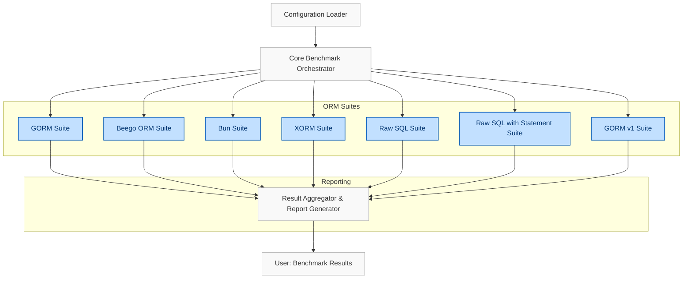

# System Architecture

## Visualizing the Core Orchestration of ORM Benchmark

Understanding the high-level architecture of ORM Benchmark is essential for appreciating how it meticulously evaluates the performance of different Go ORM libraries. This page provides a clear view of how the components—configuration loader, core orchestrator, individual ORM benchmarking suites, and the reporting engine—interact seamlessly to deliver reliable benchmark results.

---

### Why Architecture Matters

When running benchmarks, consistency, isolation, and clarity are paramount. ORM Benchmark's architecture is designed to enforce these principles by organizing each ORM adapter as an independent suite, orchestrating execution based on user configuration, and consolidating results into comprehensive reports.

This architecture ensures:
- **Repeatability**: All ORMs run under standardized conditions.
- **Scalability**: Adding or updating ORM suites is straightforward.
- **Transparency**: Clear flows from configuration to results promote trust.

---

### High-Level Components

1. **Configuration Loader**
   - Parses command-line arguments and environment variables.
   - Determines which ORMs to benchmark, concurrency levels, and database source.

2. **Core Benchmark Orchestrator**
   - Loads and initializes each ORM suite.
   - Manages concurrency settings and iteration counts.
   - Sequentially or concurrently runs benchmarks for each ORM.

3. **ORM Benchmark Suites**
   - Independent modules encapsulating benchmarking logic for each ORM (e.g., GORM, Beego ORM, Bun).
   - Each suite handles database setup (schema resets), runs defined benchmark tests (Insert, Update, Read, MultiInsert, MultiRead), and manages database connections.

4. **Reporting Engine**
   - Collects results from all ORM suites.
   - Formats and generates summary reports grouping key metrics.
   - Facilitates quick comparison across ORMs for performance evaluation.

---

### How the Flow Works from Configuration to Results

---

### Detailed Interaction Narrative

1. **User starts the tool** with various command-line options indicating which ORM libraries to test, desired concurrency, and the PostgreSQL data source.
2. The **Configuration Loader** parses these options and prepares runtime parameters.
3. The **Core Benchmark Orchestrator** uses these parameters to initialize each ORM suite.
   - For example, if the user specifies `-orm=gorm`, only the GORM suite initializes and prepares to benchmark.
4. Each **ORM Suite** performs:
   - Database preparation: dropping and recreating benchmark-specific tables to ensure a clean state.
   - Running a consistent set of benchmark scenarios including:
     - Single inserts
     - Bulk inserts (100 rows)
     - Updates
     - Single reads
     - Batch reads (multi read with limit 100)
   - ORM connections and session management configured according to concurrency parameters.
5. Results are measured in standardized iterations and collected by the **Reporting Engine**.
6. Finally, the user receives a summarized report that clearly compares the performance metrics across all tested ORMs.

---

### Practical Tips & Best Practices

- Always ensure your PostgreSQL instance is running and accessible with the DSN passed to the tool.
- Use the `-multi` flag to simulate load by increasing the base query execution multiplier.
- For accurate results, avoid running other heavy workloads on your database during benchmarking.
- Explore the individual ORM suites if you wish to customize or extend benchmarks.

---

### Troubleshooting Common Pitfalls

<AccordionGroup title="Common Pitfalls & Troubleshooting">
<Accordion title="Connection Failures to PostgreSQL">
Ensure your `-source` DSN is correct and that PostgreSQL accepts TCP connections from your client environment. Use tools like `psql` to confirm connectivity.
</Accordion>
<Accordion title="Benchmark Hang or Timeout">
High concurrency with limited database resources can cause timeouts. Reduce the `-multi` parameter or database connection limits (`max_idle`, `max_conn`).
</Accordion>
<Accordion title="Partial Benchmark Runs">
Make sure the `-orm` argument is correctly used. For all ORMs, use `-orm=all`. For specific, provide exact names such as `gorm`, `beego_orm`, `bun`.
</Accordion>
<Accordion title="Inconsistent Results Between Runs">
Database caching and background activities can distort benchmarks. To minimize effects, reboot or reset the database between runs, and run multiple tests where possible.
</Accordion>
</AccordionGroup>

---

### What’s Next

After understanding the system architecture and core component flow:

- Visit [Supported ORMs & Technologies](/overview/architecture-and-core-concepts/supported-orms) to learn about all integrated ORMs.
- Proceed to the [Integration & Setup Overview](/overview/architecture-and-core-concepts/integration-and-setup) for configuring your environment.
- Start running benchmarks by following the [Running Your First Benchmark](/getting-started/installation-and-first-run/running-your-first-benchmark) guide.

---

For additional insights, consult the [Major Features at a Glance](/overview/introduction-and-value/major-features) page to understand how these architectural pieces support advanced benchmarking capabilities.

---

_This page is part of ORM Benchmark's comprehensive documentation aiming to empower developers with confidence, clarity, and control over ORM performance testing._

---

#### Source Code Reference

See how suites are initialized and benchmarked in the [main.go](https://github.com/go-gorm/orm-benchmark/blob/main/main.go) and various [benchs/*.go](https://github.com/go-gorm/orm-benchmark/tree/main/benchs) source files.

---